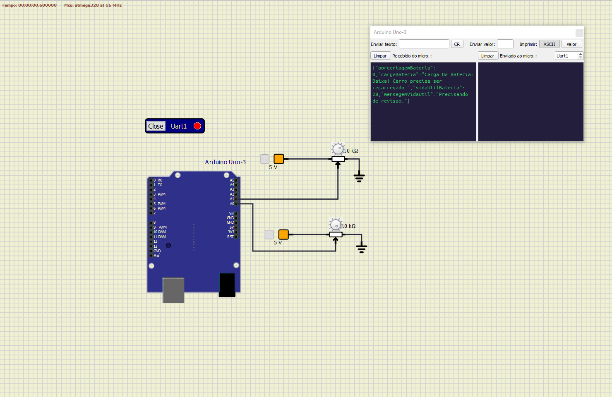
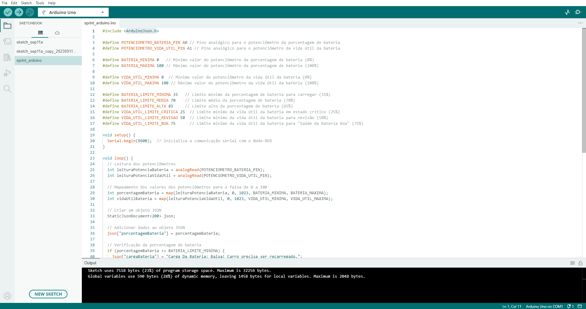
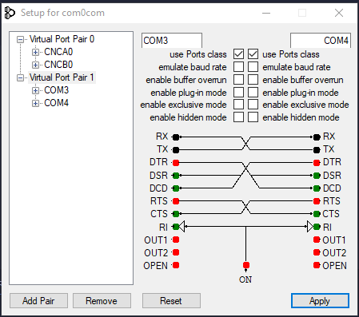
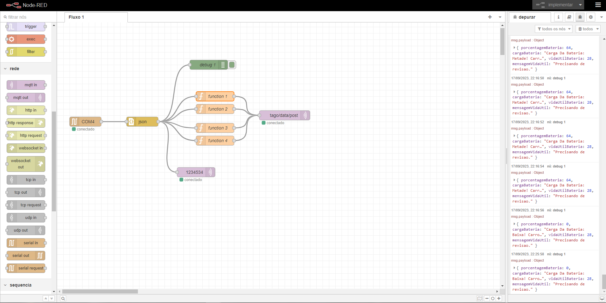

# Sprint_eng_ESA1 🚀
Nesse projeto elaboramos dois sensores das baterias dos carros eletricos onde avisa a vida util e a bateria atual do carro.

O projeto foi elaborado com arduino virtual criando uma Iot com base no node-red.

## Componentes Utilizados 🔋

- Arduino
- fios 
- Sensor de bateria (potenciometro)
- Sensor de Vida util da bateria (potenciometro)
- Tensões fixas de 5v
- Terras 0v
- Porta serial

## Bibliotecas Utilizadas 📚

- ArduinoJson.h

## Pinagem 🤏

- Pino A0: Sensor de bateria (potenciometro) 
- Pino A1: Sensor de Vida util da bateria (potenciometro)

## Aplicativos e Sites 💻

- Simulide
  

    
  

- Arduino IDE
   

    
  

- COM0COM
 

    
  

- Node-Red
 

    
  

- HiveMQ
 

    
  

- Tago.io
 

    
  

